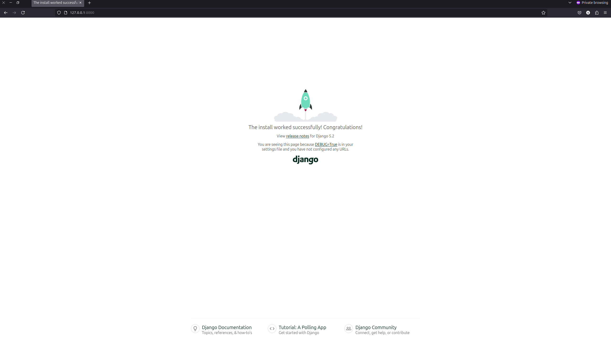

# first_project

## Project Hierarchy
>tree first_project/
```bash
first_project/   
├── first_project
│   ├── asgi.py
│   ├── __init__.py
│   ├── settings.py
│   ├── urls.py
│   └── wsgi.py
├── manage.py 
└── README.md

```
### Running project
>python manage.py runserver

```bash
Watching for file changes with StatReloader
Performing system checks...

System check identified no issues (0 silenced).

You have 18 unapplied migration(s). Your project may not work properly until you apply the migrations for app(s): admin, auth, contenttypes, sessions.
Run 'python manage.py migrate' to apply them.
April 21, 2025 - 17:31:39
Django version 5.2, using settings 'first_project.settings'
Starting development server at http://127.0.0.1:8000/
Quit the server with CONTROL-C.

WARNING: This is a development server. Do not use it in a production setting. Use a production WSGI or AS
```

### Accessing the Project in a Web Browser
